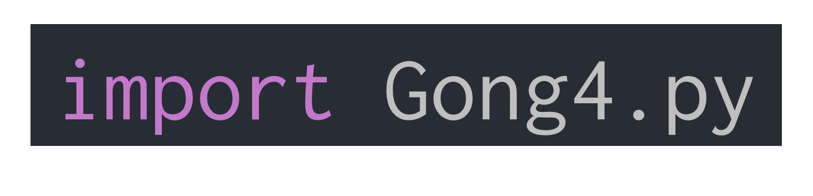

Markdown - 1. intro
===
making HTML document with ease

based on Github Flavored Markdown(GFM) rules

last edit: 2017. 4. 23 by JuneTech

Table of contents
---
1. What's Markdown?
1. Blockquotes & line breaking
1. Headers
1. List & text styling
1. Horizontial line
1. Images
1. Links
1. Code insertion & syntax highlighting
1. etc.

---

What's Markdown?
---


made by John Gruber:
> Markdown allows you to write using an easy-to-read, easy-to-write plain text format, then convert it to structurally valid XHTML (or HTML).

1. A plain text formatting syntax
1. A software tool that converts the plain text formatting to HTML
  - Various renderers exist
    - **[Github Flavored Markdown(GFM)](https://guides.github.com/features/mastering-markdown/)**
    - [Kramdown](https://kramdown.gettalong.org/)
    - ...

Blockquotes & line breaking
---

Quoting is seriously important because we copy & paste most of the things!
```
Seunghoon lee said:
>Gong4py는 이기적인 파이썬 공부모임이다.
```
Seunghoon lee said:
>Gong4py는 이기적인 파이썬 공부모임이다.

```
>Multiple line quoting is also possible.
>Yes, why not?

>what happens when we have empty line between quotes?
```
>Multiple line quoting is also possible
>Yes, why not?

>what happens when we have empty line between quotes?

***Linebreaking works this way.***

Headers
---

```
Various ways to put title on each slides
---
# H1      ##### H5
## H2     ###### H6
### H3    ####### H7?
#### H4

Only for H1 and H2:
H1
===

H2
---
```
# H1
## H2
### H3
#### H4
##### H5
###### H6
####### H7? --> does not work anymore!

Only for H1 and H2:
H1
===

H2
---

---

List & text styling
---
usage of hyphen(-), underscore(_), asterisk(*), and backtick(`)

- level 1
* also level 1
  * level 2: two spaces
  - also level 2
    * level 3: two more spaces
    - *italics*
    - _also italics_
    - -nothing happens-
    - **bold font**
    - __bold font 2__

- putting \ with special character(\-, \_, \* or \`) makes it lose its markdown function
- [Highlighting](https://github.com/chjj/marked/pull/230) with '==' does not work at this moment


Horizontal line
---
```
---: triple hyphens
***: triple asterisks
___: triple underscore
all functions as the same!
```
---
***
___

Images
---

- Reading from local directory
```

```


- Reading from URL
```

```


- Usage of alternative text
```

```


- Resizing image
```

```


- Aligning image to center
```
<p align="center">

</p>
<p align="right">

</p>
```
<p align="center">

</p>
<p align="right">

</p>


Links
---

Image insertion without !:
```
[Gong4py URL](https://gong4py.github.io)
```
[Gong4py URL](https://gong4py.github.io)

```
***[You can highlight the URL too!](https://google.com)***
```
***[You can highlight the URL too!](https://google.com)***


Code insertion & syntax highlighting
---

One line: \`python Gong4.py\` `python Gong4.py`

Code block: similar to python block commenting; use backtick(\`) instead of \'

```
 ` ` `
asdfasdf
 ` ` `
of course, erase all the blanks between backticks
```

```
asdfasdf
```

Syntax highlighting: start with \`\`\`python
```python
#! python3
'''
useless file made just for example
'''
import Gong4.py
thisJeongyeunyeon = 2017
print(hell o world!)
```

List of syntax highlight I know
- python (2 or 3 is not divided)
- console
- bash (for shell/bash script)
- c
- cpp
- brainfuck

for full list, visit [Syntax highlighting in markdown](https://support.codebasehq.com/articles/tips-tricks/syntax-highlighting-in-markdown) by Codebase

etc.
---
### emoji: [emoji cheat sheet](http://www.webpagefx.com/tools/emoji-cheat-sheet)
```
:frowning: :neutral_face: :smiling_imp: :guitar:
:notes: :question: :ok_hand: :thumbsup:

:computer: :floppy_disk: :bar_chart: :file_folder:
```

:frowning: :neutral_face: :smiling_imp: :guitar:
:notes: :question: :ok_hand: :thumbsup:

:computer: :floppy_disk: :bar_chart: :file_folder:

### task lists

- [x] Finish my changes
- [ ] Push my commits to GitHub
- [ ] Open a pull request

not working on Marp.

### Little problems
- May look different from platform to platform,
from computer to computer(with different markdown renderers)
- Some styling requires HTML, which requires us to copy & paste from stackoverflow

### Convenience
- You barely touch mouse
- Simple!
- Awesome productivity
- Cross-platform

---

Reference
---
[Markdown original website](https://daringfireball.net/projects/markdown/) by John Gruber

[Markdown Cheatsheet](https://github.com/adam-p/markdown-here/wiki/Markdown-Cheatsheet) by Adam Pritchard

[Basic writing and formatting syntax](https://help.github.com/articles/basic-writing-and-formatting-syntax/) by Github

[Resize image using Markdown](http://stackoverflow.com/questions/24383700/resize-image-in-the-wiki-of-github-using-markdown) on stackoverflow

[List of syntax highlighting in markdown](https://support.codebasehq.com/articles/tips-tricks/syntax-highlighting-in-markdown) by codebase

[Image center alignment](http://stackoverflow.com/questions/12090472/github-readme-md-center-image) on stackoverflow

---
